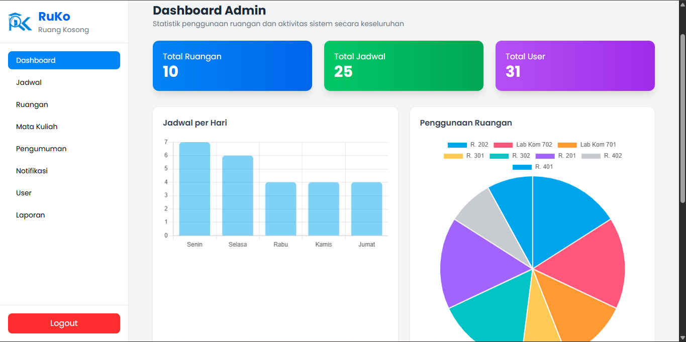
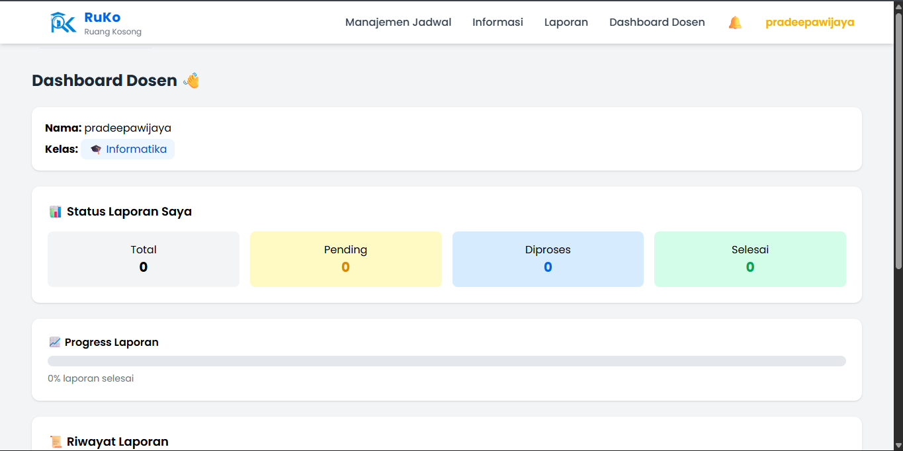
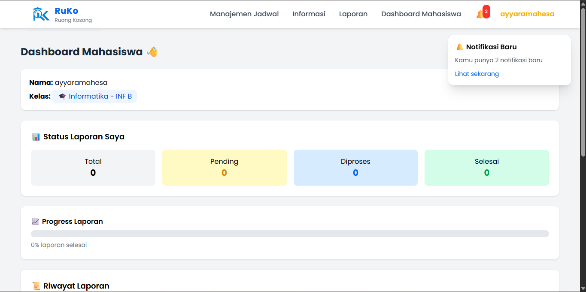
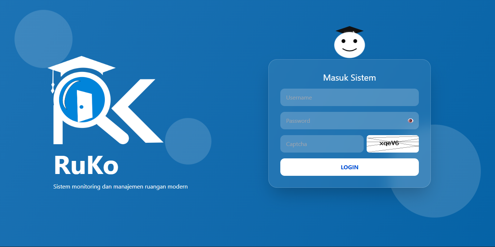

# 🚀 K3 Web Management System

> Modern Web Management System built with PHP Native, structured for scalability, collaboration, and real-world deployment.

  
  
  
  
  

------------------------------------------------------------------------

## 📌 Overview

K3 Web Management System adalah aplikasi berbasis web untuk mengelola
data akademik seperti admin, dosen, dan mahasiswa.

Dirancang menggunakan pendekatan modular untuk memudahkan: -
Maintenance - Scalability - Team collaboration

------------------------------------------------------------------------

## ✨ Features

-   🔐 Authentication System (Login & Logout)
-   👨‍💼 Admin Management
-   👨‍🏫 Dosen Management
-   🎓 Mahasiswa Management
-   📂 Modular File Structure
-   📧 Email Integration (PHPMailer)

------------------------------------------------------------------------

## 🧠 Tech Stack

------------------------------------------------------------------------

## 📸 Preview

## 📸 Dashboard Preview

<b>👨‍💼 Admin</b>

  

<b>👨‍🏫 Dosen</b>

  

<b>🎓 Mahasiswa</b>

  

### 🔐 Login Page

  

> Tambahkan screenshot sesuai tampilan project kamu

------------------------------------------------------------------------

## 🏗️ Project Structure

    kel-3/
    ├── admin/
    ├── assets/
    ├── auth/
    ├── config/
    ├── database/
    ├── dosen/
    ├── mahasiswa/
    ├── pages/
    ├── upload/
    ├── vendor/
    ├── .env
    ├── .gitignore
    ├── composer.json
    ├── composer.lock
    └── index.php

------------------------------------------------------------------------

## ⚙️ Installation

### 1. Clone Repository

    git clone https://github.com/Dani0601/kel-3.git
    cd kel-3

### 2. Install Dependencies

    composer install

### 3. Setup Environment

    cp .env.example .env

Edit file `.env`:

    MAIL_USERNAME=your_email
    MAIL_PASSWORD=your_password

### 4. Run Application

    http://localhost/kel-3

------------------------------------------------------------------------

## 🔒 Security Best Practices

-   Jangan commit `.env`
-   Jangan commit `/vendor`
-   Gunakan `.env` untuk kredensial
-   Gunakan `composer.lock` untuk konsistensi dependency

------------------------------------------------------------------------

## 🔁 Development Workflow

    git pull
    composer install

Update dependency:

    composer update
    git commit -m "Update dependencies"

------------------------------------------------------------------------

## ⚠️ Troubleshooting

### Composer not recognized

    composer -V

### Vendor missing

    composer install

### Email not working

-   Cek `.env`
-   Gunakan App Password Gmail

------------------------------------------------------------------------

## 📈 Future Improvements

-   Migrasi ke Laravel
-   REST API Implementation
-   UI/UX Enhancement
-   Role-based access control

------------------------------------------------------------------------

## 👨‍💻 Team

- **Dani Hidayat** — Developer  
  🔗 https://github.com/Dani0601  

- **Naula Alfiyatul Fauziyyah** — Developer  
  🔗 https://github.com/naulla

- **Alfiah Lutfi Sabilah** — Developer
  🔗 https://github.com/alfiahlutfi

------------------------------------------------------------------------

## ⭐ Portfolio Highlights

Project ini menunjukkan: - Dependency management dengan Composer -
Environment configuration (.env) - Modular architecture - Git
collaboration workflow

------------------------------------------------------------------------

## 📜 License

MIT License
